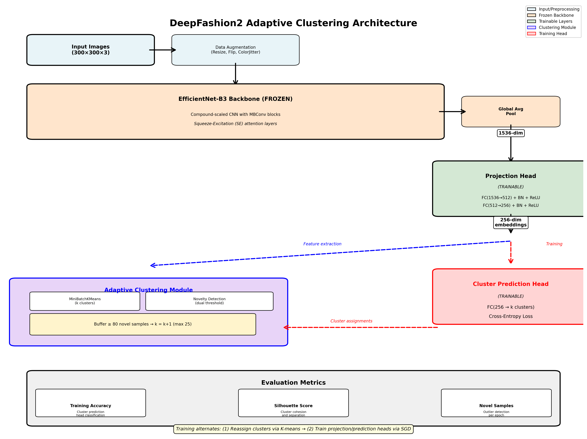

# DeepFashion2 Adaptive Clustering
### Unsupervised Fashion Discovery via Deep Clustering with Dynamic K-Means

[](https://www.python.org/downloads/)
[](https://pytorch.org/)
[](https://opensource.org/licenses/MIT)

An unsupervised deep learning approach to automatically discover fashion categories using adaptive clustering. This project implements a **DeepCluster-inspired** architecture with EfficientNet-B3 backbone and dynamic cluster expansion based on novelty detection.



---

## Overview

Traditional fashion classification models rely on predefined category labels that fail to capture the nuanced diversity and evolving nature of fashion styles. This project explores **unsupervised fashion categorization** through adaptive clustering, enabling automatic discovery of fashion categories without labeled data.

### Key Features

- **Frozen EfficientNet-B3 backbone** pretrained on ImageNet for robust feature extraction
- **Trainable projection head** that learns 256-dim embeddings optimized for clustering
- **Adaptive MiniBatchKMeans** with dynamic cluster expansion (k=10→18)
- **Dual-threshold novelty detection** combining distance and confidence metrics
- **DeepCluster training paradigm** alternating between clustering and supervised learning
- **Feature caching** for efficient re-clustering across epochs

---

## 🏗️ Architecture

### Pipeline Overview

```
Input Images (300×300×3)
    ↓
Data Augmentation (flip, color jitter, rotation)
    ↓
EfficientNet-B3 Backbone (FROZEN)
    └─→ Global Average Pooling → 1536-dim features
         ↓
    Projection Head (TRAINABLE)
         └─→ FC(1536→512) + BN + ReLU + Dropout
         └─→ FC(512→256) + BN + ReLU
              ↓
         256-dim embeddings
         ↓          ↓
    Clustering  Training Head
    (K-Means)   (FC 256→k)
         ↓          ↓
    Novelty    Cross-Entropy
    Detection     Loss
```

### Novelty Detection

The system uses **dual-threshold novelty detection** to identify samples that don't fit existing clusters:

1. **Distance-based**: `distance > μ + 2σ`
2. **Confidence-based**: `confidence < 0.6`
   - Where `confidence = 1 - (min_distance / max_distance)`

When 80 novel samples accumulate, the system expands by one cluster: `k → k+1` (max k=25).

---

## Installation

### Requirements

```bash
# Clone the repository
git clone https://github.com/yourusername/deepfashion2-adaptive-clustering.git
cd deepfashion2-adaptive-clustering

# Install dependencies
pip install torch torchvision efficientnet-pytorch
pip install scikit-learn pillow matplotlib tqdm
```

### Google Colab Setup

This project is designed to run on **Google Colab with T4 GPU**:

1. Upload the notebook to Colab
2. Set Runtime → Change runtime type → **T4 GPU**
3. Mount Google Drive for data persistence
4. Get Kaggle API credentials from https://www.kaggle.com/settings

---

## Dataset

**DeepFashion2**: Large-scale fashion dataset with diverse clothing categories

- **Source**: [Kaggle - DeepFashion2 Original Images](https://www.kaggle.com/datasets/thusharanair/deepfashion2-original-with-dataframes)
- **Training samples**: 40,940 images
- **Validation samples**: 25,988 images
- **Format**: RGB images, various resolutions (resized to 300×300)

### Download Instructions

```python
# The notebook handles Kaggle download automatically
# Just upload your kaggle.json when prompted
```

---

## Usage

### Quick Start

1. Open `DeepFashion2AdaptiveClustering.ipynb` in Google Colab
2. Upload your `kaggle.json` API key when prompted
3. Run all cells - the notebook handles:
   - Dataset download (~20-40 min, one-time)
   - Feature caching to Google Drive
   - Adaptive clustering training
   - Checkpoint saving

### Training Configuration

Key hyperparameters in the `Config` class:

```python
IMAGE_SIZE = 300              # Input image size
BATCH_SIZE = 32               # Training batch size
LEARNING_RATE = 1e-4          # Adam optimizer learning rate
NUM_EPOCHS = 8                # Total training epochs
REASSIGN_FREQUENCY = 1        # Re-cluster every N epochs

# Clustering
INITIAL_K = 10                # Starting number of clusters
MAX_K = 25                    # Maximum clusters allowed
NOVELTY_BUFFER_SIZE = 80      # Samples before expansion

# Architecture
PROJECTION_DIM = 256          # Embedding dimensionality
HIDDEN_DIM = 512              # Projection head hidden size
```

### Feature Caching

Features are cached to Google Drive after extraction:

```
DeepFashion_Project/
├── feature_cache/
│   ├── features_epoch_0.pkl
│   ├── features_epoch_1.pkl
│   └── ...
├── checkpoints/
│   ├── checkpoint_epoch_2.pt
│   ├── checkpoint_epoch_4.pt
│   └── final_model.pt
```

---

## 📈 Results

### Training Progression

| Epoch | Clusters (k) | Silhouette | Avg Confidence | Train Acc | Novel Samples |
|-------|--------------|------------|----------------|-----------|---------------|
| 1     | 10 → 11      | -0.0050    | 0.6287         | 39.54%    | 12,199        |
| 2     | 11 → 12      | 0.0404     | 0.6500         | 50.08%    | 5,092         |
| 3     | 12 → 13      | 0.0883     | 0.7565         | 49.47%    | 1,644         |
| 4     | 13 → 14      | 0.1269     | 0.7969         | **51.40%** | 1,607        |
| 5     | 14 → 15      | 0.1309     | 0.8049         | 50.92%    | 1,575         |
| 6     | 15 → 16      | 0.1429     | 0.8197         | 51.25%    | 1,659         |
| 7     | 16 → 17      | 0.1426     | **0.8228**     | 50.93%    | 1,591         |
| 8     | 17 → 18      | **0.1493** | 0.8062         | 49.55%    | 1,585         |

### Key Findings

**Adaptive expansion successful**: System grew from 10 to 18 clusters based on data complexity

**High confidence**: Average 0.82 means most samples (96%) fit well into discovered clusters

**Learned representations**: Silhouette improved from -0.005 → 0.15, showing projection head learned meaningful structure

**Better than random**: 51% accuracy across 17 categories vs. 5.9% random baseline (9× improvement)

**Weak separation**: Silhouette score of 0.15 indicates overlapping clusters, suggesting fashion categories exist on a continuum

### Sample Cluster Distribution (Final k=18)

Clusters show reasonable balance with no extreme dominance:

```
Cluster  0: 2,065 samples (5.0%)
Cluster  1: 2,618 samples (6.4%)
...
Cluster 14: 3,176 samples (7.8%)  ← Largest
...
Cluster 17: 1,596 samples (3.9%)
```

---

## Technical Details

### DeepCluster Training Loop

The model alternates between two phases:

**Phase 1: Cluster Reassignment** (every epoch)
1. Extract 256-dim embeddings for all training images
2. Run MiniBatchKMeans clustering
3. Detect novel samples via dual thresholds
4. Expand clusters if buffer ≥ 80 novel samples
5. Assign pseudo-labels based on cluster membership

**Phase 2: Supervised Training**
1. Cluster prediction head (FC: 256 → k) maps embeddings to logits
2. Cross-entropy loss trains projection + prediction heads
3. EfficientNet backbone remains frozen
4. Optimizer: Adam (lr=1e-4, weight_decay=1e-5)

### Why This Approach?

- **Frozen backbone**: Prevents overfitting to self-discovered clusters while leveraging ImageNet features
- **Adaptive k**: Discovers optimal number of categories from data rather than assuming fixed taxonomy
- **Projection head**: Learns embedding space optimized for clustering (vs. ImageNet classification)
- **Novelty detection**: Identifies when model needs more capacity (new clusters) to capture data complexity

---

## Future Work

### 1. Fine-tune the Backbone
Currently, EfficientNet-B3 uses generic ImageNet features. Fine-tuning on fashion data could capture domain-specific patterns (fabric textures, clothing silhouettes, style details).

### 2. Graph Neural Network Extension
The observed cluster overlap (silhouette = 0.15) suggests fashion categories exist on a continuum. A **GNN approach** could:
- Encode embeddings as graph nodes
- Model inter-cluster relationships via edge weights
- Learn soft cluster membership and hierarchical structure
- Use attention mechanisms to identify most discriminative features

### 3. Semi-Supervised Labeling
Use learned cluster structure to guide efficient manual annotation:
- Label cluster centroids and boundary samples
- Propagate labels based on GNN-learned similarities
- Convert unsupervised discoveries into interpretable taxonomy

### 4. Alternative Architectures
- **Vision Transformers**: Replace EfficientNet with ViT for global context
- **Contrastive Learning**: Add SimCLR or MoCo pretraining for better embeddings
- **Hierarchical Clustering**: Discover both coarse (tops/bottoms) and fine-grained (t-shirt/blouse) categories

---

## Citation

If you use this code in your research, please cite:

```bibtex
@misc{deepfashion2-adaptive-clustering,
  author = {Lucas Papadopoulos},
  title = {Gradient Descent Into Style},
  year = {2025},
  publisher = {GitHub},
  url = {(https://github.com/lucaspapadop/GradientDescentIntoStyle)}
}
```

---

## Acknowledgments

- **Max Bradley**: [My teacher]
- **DeepFashion2 Dataset**: [Ge et al., CVPR 2019](https://github.com/switchablenorms/DeepFashion2)
- **EfficientNet**: [Tan & Le, ICML 2019](https://arxiv.org/abs/1905.11946)
- **DeepCluster**: [Caron et al., ECCV 2018](https://arxiv.org/abs/1807.05520)
- **efficientnet-pytorch**: [Luke Melas-Kyriazi](https://github.com/lukemelas/EfficientNet-PyTorch)

---

## License

This project is licensed under the MIT License - see the [LICENSE](LICENSE) file for details.

---

## Contributing

Contributions are welcome! Please feel free to submit a Pull Request.

1. Fork the repository
2. Create your feature branch (`git checkout -b feature/AmazingFeature`)
3. Commit your changes (`git commit -m 'Add some AmazingFeature'`)
4. Push to the branch (`git push origin feature/AmazingFeature`)
5. Open a Pull Request

---

## Contact

Lucas Papadopoulos - lucas.popadopoulos@gmail.com

Project Link: [https://github.com/lucaspapadop/deepfashion2-adaptive-clustering](https://github.com/lucaspapadop/deepfashion2-adaptive-clustering)

---

## Star History

If you find this project useful, please consider giving it a star! 

[](https://star-history.com/#yourusername/deepfashion2-adaptive-clustering&Date)
